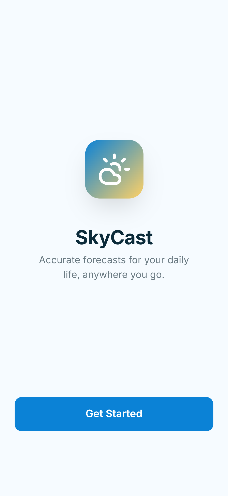
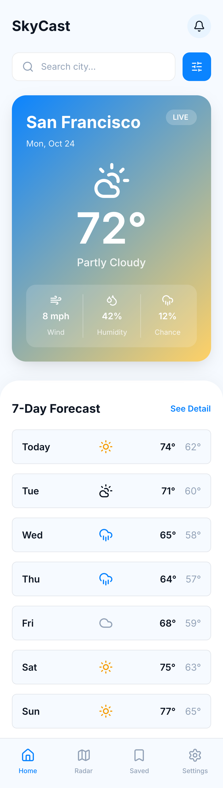

# Weather-App
🌦 SwiftUI Weather App

A SwiftUI-based weather application demonstrating networking, async/await, data caching, and robust state management using a clean MVVM architecture.

The app focuses on proper separation of concerns, reusable service layers, graceful error handling, and resilience against network failures, following real-world iOS development best practices.

## ✨ Features

- Splash Screen with automatic navigation (reused from previous task)  
- Home Screen with weather search  
- Current weather summary  
- 7-day weather forecast  
- Pull-to-refresh support  
- Optional Weather Detail Screen  
- Asynchronous networking using async/await  
- Local caching using SwiftData  
- Graceful error handling with fallback to cached data  
- Dependency Injection  
- Strict MVVM + Service Layer architecture  

## 🖼 Screenshots

 
 
 
 

## 🔄 App Flow

### App Launch
- The app starts with a Splash Screen  
- Automatically navigates to the Home Screen  
- Cached weather data is loaded if available  

### 🏠 Home Screen

**UI Components**
- App title / header  
- Search bar for city input  
- Current Weather Card:
  - City name
  - Temperature
  - Weather condition icon
  - Humidity
  - Wind speed
- 7-Day Forecast list (scrollable)  

**UI Behavior**
- Typing a city name and pressing search triggers a weather request  
- Search button is disabled if the city field is empty  
- Pull-to-refresh reloads current weather and forecast  
- Skeleton loader / progress indicator is shown while fetching data  
- Error banner is displayed if the API call fails  
- Cached data is shown when network requests fail  

### 📅 Forecast List
- Each forecast item displays:
  - Day  
  - Weather icon  
  - Minimum temperature  
  - Maximum temperature  
- Tapping on a forecast item navigates to the Detail Weather Screen (optional)

### 📊 Detail Weather Screen (Optional / Bonus)
- Displays extended weather information for a selected day:
  - Hourly temperature forecast  
  - UV index  
  - Sunrise and sunset times  
- Scrollable layout  
- Back navigation to Home Screen  

## 🧠 Architecture & Approach

The app follows a strict MVVM + Service Layer approach:

**View**
- Renders UI  
- Binds to observable state  
- Contains no business or networking logic  

**ViewModel**
- Handles API calls  
- Manages loading, success, and error states  
- Performs validation  
- Coordinates caching logic  

**Service Layer**
- NetworkService handles all network requests  
- Uses URLSession with async/await  
- Decodes responses using Codable  
- Is reusable across multiple endpoints  
- Injected into ViewModels via Dependency Injection  

## 💾 Data Persistence & Caching
- Last successful weather response is cached using SwiftData  
- Cached data is displayed if:
  - No internet connection is available  
  - API request fails  
- Cache is updated on every successful API call  

## 🚨 Error Handling & States

**Error Scenarios**
- No internet connection → “No internet connection”  
- Invalid city name → “City not found”  
- API failure → “Something went wrong. Try again.”  

**UI States**
- Loading → Skeleton loader / progress indicator  
- Success → Display fetched weather data  
- Failure → Show error banner and cached data if available  

## 🚫 Restrictions Followed
- ❌ No third-party networking libraries (e.g. Alamofire)  
- ❌ No API calls inside Views  
- ❌ No singletons for NetworkService  
- ❌ Main thread is never blocked  
- ❌ MVVM architecture is strictly followed  

## 🛠 Tech Stack
- Swift  
- SwiftUI  
- Async/Await  
- URLSession  
- SwiftData  
- MVVM  
- OpenWeather API  

## 👩‍💻 Author
**Nadira Seitkazy**  
Junior iOS Developer
